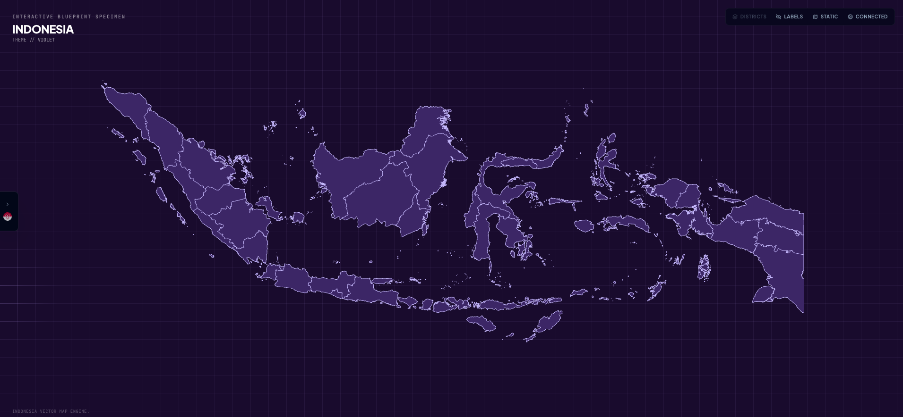

# IndoMaps

Interactive map of Indonesia — explore provinces, cities, and subdistricts, customize themes, and export print-ready posters.



## Features

### Editor (`/`)

The main playground for styling and exporting the map.

- Pan and zoom across Indonesia with province-level detail
- Click regions to inspect names, codes, and population data
- Switch between theme presets (Blueprint, Batik, Mono, Light, Violet) and tweak CSS variables live
- Toggle labels, static mode, and connected maps
- Export the current view as SVG
- Send the current theme and selection to the Poster page

### Demo (`/demo`)

A showcase of interactive map capabilities.

- Standard selection mode with capital city pins
- Choropleth mode with sample GDP data by province
- Region info panel with population formatting

### Poster (`/poster`)

Design and export wall-ready map posters.

- Paper sizes from A4 through A1, portrait or landscape
- Export quality at 72, 150, or 300 DPI
- Custom title, subtitle, and coordinates
- Download as SVG or PNG
- Accepts handoff state from the Editor

## Tech stack

- **React 19** + **TypeScript**
- **Vite** for dev and build
- **Tailwind CSS v4** for styling
- **React Router** for page routing
- **Lucide React** for icons
- Custom SVG map renderer with GeoJSON projection

## Getting started

```bash
# install dependencies
npm install

# start dev server
npm run dev

# production build (compresses GeoJSON, type-checks, bundles)
npm run build

# preview production build
npm run preview

# lint
npm run lint
```

The dev server runs at `http://localhost:5173` by default.

## Map data

Administrative boundary GeoJSON lives in `public/exports/`:

| File | Level |
|------|-------|
| `indonesia-provinces.geojson` | Provinces |
| `indonesia-cities.geojson` | Cities / regencies |
| `indonesia-subdistricts.geojson` | Subdistricts |

At build time, `scripts/compress-geojson.mjs` gzip-compresses each `.geojson` file into a `.geojson.gz` sibling. The app fetches the compressed assets at runtime from `/exports/`.

To recompress after editing source GeoJSON:

```bash
npm run compress:geojson
```

## Project structure

```
src/
  components/
    IndonesiaMap.tsx   # SVG map renderer, zoom, selection, overlays
    Sidebar.tsx        # Shared navigation shell
    InfoPanel.tsx      # Region detail panel
  pages/
    Playground.tsx     # Editor
    Demo.tsx           # Interactive demo
    Poster.tsx         # Poster designer & export
  data/
    themes.ts          # Color presets and CSS variable keys
    provinceMeta.ts    # Province metadata
    posterSizes.ts     # Print dimensions and DPI
  utils/
    geoData.ts         # GeoJSON loading and caching
    mapData.ts         # Path parsing and projection
    render.ts          # SVG export
    posterExport.ts    # PNG/SVG poster export
public/
  logo.svg             # App icon
  site.webmanifest     # PWA manifest
  exports/             # GeoJSON boundary data
```

## Scripts

| Command | Description |
|---------|-------------|
| `npm run dev` | Start Vite dev server with HMR |
| `npm run build` | Compress GeoJSON, type-check, and build for production |
| `npm run preview` | Serve the production build locally |
| `npm run lint` | Run ESLint |
| `npm run compress:geojson` | Gzip-compress GeoJSON files in `public/exports/` |

---
## License

MIT - see [LICENSE](LICENSE).